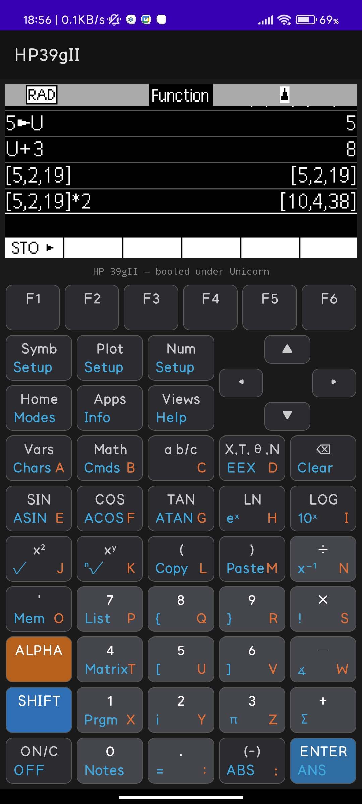

## It's ALIVE



---

# HP 39gII — Reverse-Engineering the Calculator OS

Extracting the calculator engine out of the official **HP 39gII** Windows emulator
(`HP39gII.exe`) and running it under raw CPU emulation — no Windows, no MFC, no GUI —
so the same calculator core can be driven on Android and in the browser with our own input and display.

This repo is the reverse-engineering work and the emulation harness. It does **not**
contain HP's binaries (see [Getting the binary](#getting-the-binary)).

---

## But Why!

Because it was a DREAM for *years* to run it on my phone! I just love hp39gII specifically because this is the parent project of what actually became hp Prime calculator! And look at the high-res screen, and its programming! Everything.
`HP39gII.exe` is a Windows executable, the calculator is a self-contained engine
buried inside a desktop GUI shell. This
project is aimed to run HP's original x86 calculator code unmodified inside a
[Unicorn Engine](https://www.unicorn-engine.org/) sandbox, with a hand-written Win32
shim standing in for the operating system. Map the PE, fake just enough of Windows to
keep the code happy, and drive the calculator core directly.

The payoff: the *exact* behavior of the real calculator — every rounding quirk and
display glyph — on platforms HP never shipped to.

## Status / milestones

| # | Milestone | Status |
|---|-----------|--------|
| M1 | PE loader + Unicorn x86 boot, IAT trampolines, Win32 shim | ✅ |
| M2 | Calc core boots headless, reaches main message loop | ✅ |
| M3 | Drive "1 + 1 = ENTER", dump & decode framebuffer | ✅ |
| — | **Boots under Unicorn on Android (Termux)** | ✅ |
| — | Android app: Unicorn x86 linked & executing on-device (Phase A) | ✅ |
| — | Android app: loader ported to C++, calc core boots on-device (Phase B) | ✅ |
| — | **Android app: interactive keypad + live framebuffer — working calculator** (Phase C) | ✅ |
| — | Browser port (Unicorn 2.x → WASM via Emscripten) | 🔜 |

## Android app (`android/`)

A native Android app (Kotlin + NDK/JNI) that links **Unicorn Engine 2.1.4** and runs
the same x86 calculator core on-device. Phase A is working: Unicorn is cross-compiled,
statically linked into the app's `.so`, and verified executing guest x86 on the emulator.

Phases B and C are working: `harness/headless/load.py` is ported to C++
(`android/app/src/main/cpp/emu.cpp`) — the calc core boots inside the app and reaches
the same main-loop entry (`EIP=0x401730`) as the Python harness, bit-for-bit. The app
then drives the firmware directly: a 51-key on-screen keypad injects keypresses
(`enqueue → press → drain/tick → release`) and the live 256×127 framebuffer is decoded
and rendered. Tapping `1 + 1 = ENTER` shows `2`, computed by HP's own code. You supply
`HP39gII.exe` in `app/src/main/assets/` (gitignored).

### ▶ Run it on your Android phone

For building on android **[`android/README.md`](android/README.md)** — it covers building the native library, where to drop your `HP39gII.exe`, and installing the app over USB.

**Building Unicorn for Android needs one step**, because Unicorn embeds QEMU and QEMU's
`configure` needs POSIX tooling:

- **macOS / Linux:** build natively, no Docker — `android/docker/build-unicorn-native.sh`.
- **Windows:** that POSIX tooling isn't available on a bare host, so the build runs inside
  a Linux container via Docker. **Docker is only required on Windows.**

Full instructions (both paths) are in [`android/docker/README.md`](android/docker/README.md).
Prebuilt libs are gitignored; you regenerate them once, then build the app normally.

## How it works

- **`harness/headless/load.py`** — the core. Maps the PE at its image base, sets up a
  GDT/TIB so 32-bit segment registers work, hooks every Import Address Table entry, and
  implements ~69 Win32 / CRT shim handlers (heap, threads, mutexes, file probes). Boots
  the calc-core thread and halts at the main loop entry.
- **`harness/headless/m3_one_plus_one.py`** — boots headless, then calls directly into
  emulated functions to inject keys and dump the 256×127 framebuffer to PGM, with MD5s
  for comparison against the native reference.
- **`harness/`** — native Windows probes (`inject.cpp`, `probe.cpp`) used to capture
  "gold" framebuffer output from the real emulator for differential validation.
- **`analyze_*.py`** — Ghidra-assisted analysis scripts mapping out the core, imports,
  display, framebuffer, and startup paths.
- **`web/`** — early browser port experiment (asm.js Unicorn). See `RESEARCH_NOTES.md`
  for why this is being redone with Unicorn 2.x → WASM.
- **`RESEARCH_NOTES.md`** — the full reverse-engineering logbook: struct layouts,
  function addresses, the widget/paint model, skin format, and dead-ends.

## Getting the binary

This project needs `HP39gII.exe` from HP's free emulator, which is **not** redistributed here (it's HP's copyrighted software). Obtain it from HP's official download for the HP 39gII connectivity/emulator package, then place `HP39gII.exe` either:

- next to `harness/headless/load.py`, or
- at the repo root, or
- anywhere, and point to it: `HP39GII_EXE=/path/to/HP39gII.exe`
- for the **Android app**: copy it to `android/app/src/main/assets/HP39gII.exe`
  (create the `assets/` folder if it isn't there) — see [`android/README.md`](android/README.md)

## Running the headless harness

```bash
pip install unicorn pefile
python harness/headless/load.py          # boot to main loop (M1/M2)
python harness/headless/m3_one_plus_one.py   # drive 1+1= and dump the screen (M3)
```

### On Android (Termux)

```bash
pkg install python clang cmake make pkg-config
pip install --no-binary :all: unicorn    # build Unicorn against bionic libc
pip install pefile
python load.py
```

> The pip-prebuilt `libunicorn.so` is glibc-linked and won't load under Termux's bionic
> libc — building from source fixes the `Failed to load the Unicorn dynamic library` error.

## Legal

This repository contains only original reverse-engineering code and notes. HP, HP 39gII,
and the calculator firmware/emulator are property of HP Inc. No HP binaries, manuals, or
skin assets are included. This work is for interoperability and educational purposes.

## License

MIT — see [LICENSE](LICENSE). Applies to the code in this repository only, not to any
HP-owned material you supply separately.
